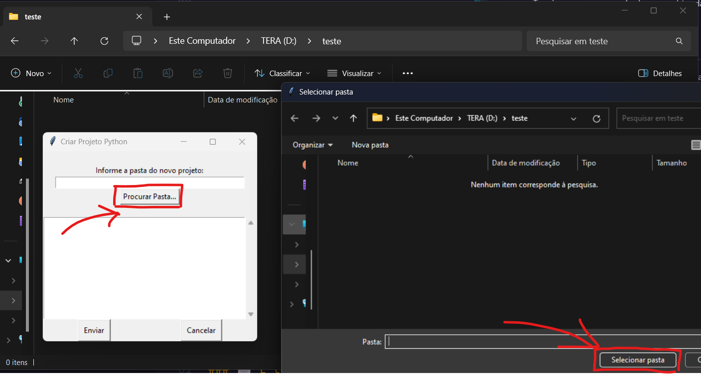
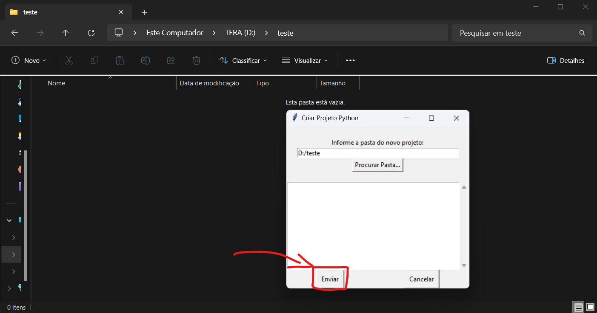
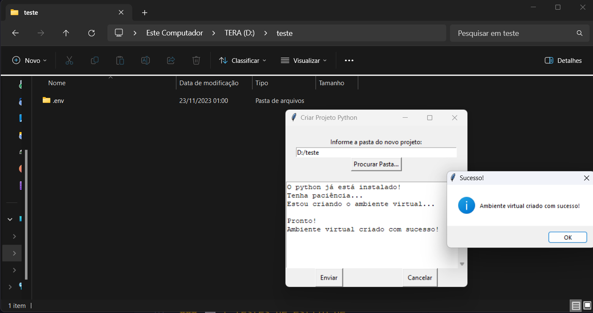

# Criador de Projetos Python - Tkinter

Já pensou em criar seus futuros projetos python apenas com um clik?

O **Projeto-Auto-Py** faz isso pra você de forma automatizada e fácil.

## 🚀 Começando

Essas instruções permitirão que você obtenha uma cópia do projeto em operação na sua máquina local para fins de desenvolvimento e teste.

### 📋 Pré-requisitos

**Sistema Operacional:** Windows-64x

**Python:** [Python-3.11.5-amd64.exe](https://www.python.org/ftp/python/3.11.5/python-3.11.5-amd64.exe) (recomendado)

Para mais informações: [Link do instalador para mais versões](https://www.python.org/downloads/release/python-3115/)

### 🔧 Instalação

É simples, siga esses pequenos passos:

1. Instale o Python

    [Python-3.11.5-amd64.exe](https://www.python.org/ftp/python/3.11.5/python-3.11.5-amd64.exe)

2. Instale o projeto

    [projeto_auto_py-master.zip](https://github.com/tupiribas/projeto_auto_py/archive/refs/heads/master.zip)

3. Descompate o projeto

4. Abra o executável (.exe)

    Para **abrir o executável do projeto** é por esse caminho:
    
        C:\...\projeto_auto_py-master\dist\main.exe

**Pronto!**
**Agora, é só executar e ser feliz.**

## ⚙️ Demonstração do Funcionamento

#### 1. Tela Principal: 

#### 2. Selecionando a Pasta do Projeto:

#### 3. Enviando Arquivo: 

#### 4. Projeto Criado com Sucesso: 

### Processos no Windows

## 🛠️ Bibliotecas

* [Tcl/Tkinter -v ](https://docs.python.org/3/library/tkinter.html) - Biblioteca Nativa do proprio python

## 📌 Versão

Usei [SemVer](http://semver.org/) para controle de versão. Para as versões disponíveis, observe as [tags neste repositório](https://github.com/tupiribas/projeto_auto_py). 

## ✒️ Autor

* **Tupi Guedes** - *Total* - [tupiribas](https://github.com/tupiribas)

## 📄 Licença

Este projeto está sob a licença MIT License, veja o arquivo [LICENSE.md](https://github.com/tupiribas/projeto_auto_py/blob/master/LICENSEhttps://github.com/usuario/projeto/licenca) para detalhes.

## 🎁 Expressões de gratidão

Conte a outras pessoas sobre este projeto! 📢

---
⌨️ com ❤️ por [Tupi Guedes](https://gist.github.com/lohhans) 😊